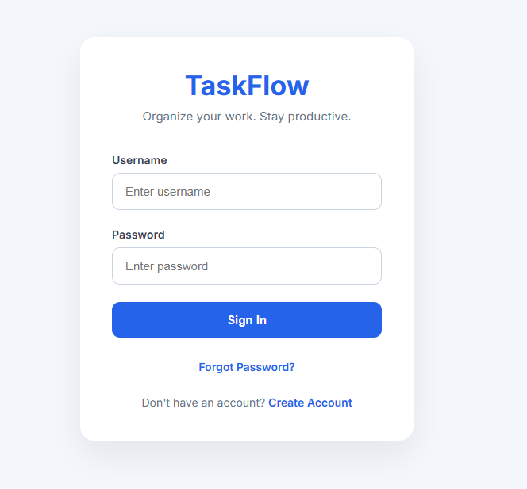
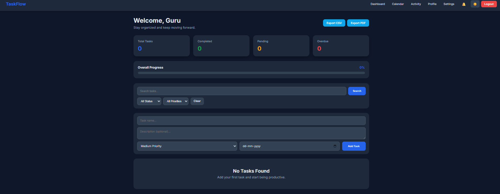
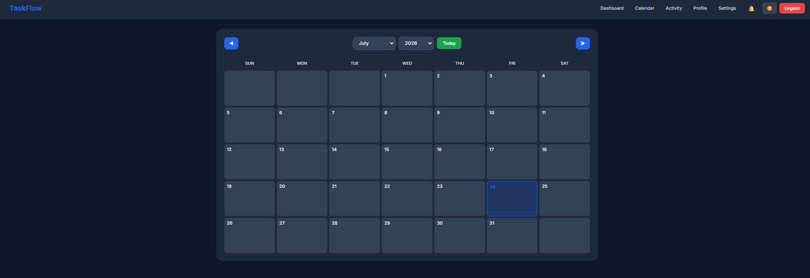
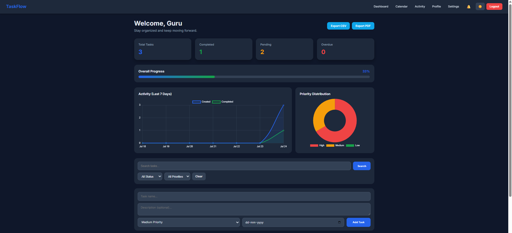
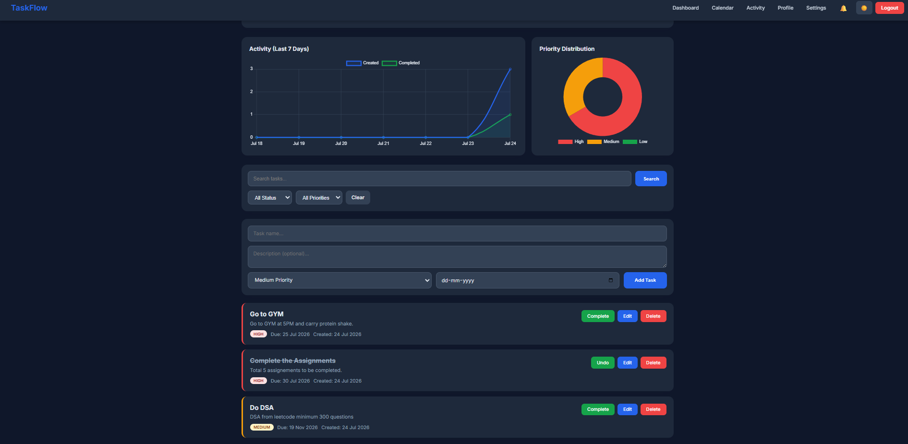

# 🚀 TaskFlow – Full-Stack Task Management Web Application


**TaskFlow** is a task management web application built with Django. It helps users organize daily tasks with priorities, due dates, analytics, and a responsive interface.

---

## 🌟 Features

### 🔐 Authentication & Security

- User registration and login system
- Secure password hashing using PBKDF2-SHA256
- Password reset flow via email
- Session-based authentication
- User-specific data isolation

### ✅ Task Management

- Create, Read, Update, and Delete (CRUD) operations
- Task priorities (Low, Medium, High) with color coding
- Due-date scheduling with overdue detection
- Task descriptions
- Mark tasks as complete or incomplete
- Delete confirmation modal

### 🔍 Search & Filtering

- Search tasks by name
- Filter by status (All, Pending, Completed, Overdue)
- Filter by priority (Low, Medium, High)
- Sort tasks by Newest, Oldest, Due Date, Priority, or Name

### 📊 Analytics Dashboard

- Interactive charts powered by Chart.js
- 7-day activity trends using a line chart
- Priority distribution using a doughnut chart
- Overall progress with percentage
- Statistics cards for Total, Completed, Pending, and Overdue tasks

### 📅 Calendar View

- Monthly calendar with tasks displayed on their due dates
- Month and year navigation
- "Today" button to quickly jump to the current date
- Color-coded tasks based on priority
- Responsive calendar layout

### 🕒 Activity Timeline

- Activity logging for task actions
- Tracks actions such as creating, editing, completing, and deleting tasks
- Color-coded activity timeline
- Displays the latest 100 activities

### 🔔 Notifications

- Notifications for overdue and due-today tasks
- Native OS notifications
- In-app notification page with categorized alerts
- Notification deduplication to prevent repeated alerts

### 📤 Data Export

- **CSV Export** – Download tasks in spreadsheet format
- **PDF Export** – Generate formatted PDF reports using ReportLab
- Formatted tables with headers and styling

### 🎨 UI/UX Highlights

- **Dark Mode** – Light, Dark, and System theme options
- **Responsive Design** – Mobile-friendly layout with hamburger menu
- **Loading Animations** – Button spinners, fade-in cards, and slide-up modals
- **Modal Confirmations** – Delete confirmation dialogs
- Smooth transitions and hover effects

### 👤 User Profile & Settings

- Editable user profile with name, bio, and email
- Profile statistics including total tasks, completed tasks, and join date
- Customizable default priority and sort order
- Theme preferences saved for each user
- Notification preferences

---

## 🖼️ Screenshots

### Login Page



### Dashboard



### Calendar View



### Analytics




---

## 🛠️ Tech Stack

| Category | Technology |
|----------|------------|
| **Backend** | Django 4.2, Python 3.13 |
| **Frontend** | HTML5, CSS3, JavaScript (ES6) |
| **Database** | SQLite 3 |
| **Charts** | Chart.js |
| **PDF Generation** | ReportLab |
| **Authentication** | Django Authentication |
| **Fonts** | Google Fonts (Inter) |

---

## 📦 Installation

### Prerequisites

- Python 3.10 or higher
- pip (Python package manager)
- Git

### Setup Instructions

#### 1. Clone the repository

```bash
git clone https://github.com/GurusricharanVadaparthi/Task-Flow.git
cd Task-Flow
